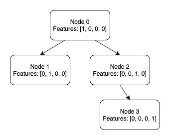

# pytorch-tree-lstm

This repo contains a Pytorch implementation of the child-sum Tree-LSTM model
([Tai et al. 2015](https://arxiv.org/abs/1503.00075)) implimented with
vectorized tree evaluation and batching.  This module has been tested with
Python 3.6.6, Pytorch 0.4.0, and Pytorch 1.0.1.

## High-level Approach

Efficient batching of tree data is complicated by the need to have evaluated all
of a node's children before we can evaluate the node itself.  To minimize the
performance impact of this issue, we break the node evaluation process into
steps such that at each step we evaluate all nodes for which all child
nodes have been previously evaluated.  This allows us to evaluate multiple nodes
with each torch operation, increasing computation speeds by an order of magnitude
over recursive approaches.

As an example, consider the following tree:



On the first step of the tree calculation, we can evaluate nodes 1 & 3 in parallel
as neither has any child nodes.  At the second step we are able to evaluate node
2, as its child node 3 was evaluated previously.  Lastly we evaluate node 0, which
depends on nodes 1 and 2.  Doing this we can reduce a four-node computation to three
steps.  Bigger trees with more leaf nodes will experience larger performance gains.

To facilitate this approach we encode the Tree structure and features into four
Tensors.  For a tree with N nodes, E edges, and F features, the required Tensors
are:

* `features` - A size N x F tensor containing the features for each node.
* `node_evaluation_order` - A size N tensor containing the calculation step at which
a node can be evaluated.
* `adjacency_list` - A size E x 2 tensor containing the node indexes of the
parent node and child node for every connection in the tree.
* `edge_evaluation_order` - A size E tensor containing the calculation step at which
each child node should be summed.

The tensor representation of the example tree above would be:

```python
features: tensor([[1., 0., 0., 0.],
                  [0., 1., 0., 0.],
                  [0., 0., 1., 0.],
                  [0., 0., 0., 1.]])

node_evaluation_order: tensor([2, 0, 1, 0])

adjacency_list: tensor([[0, 1],
                        [0, 2],
                        [2, 3]])

edge_evaluation_order: tensor([2, 2, 1])
```

## Usage

The file `tree_list.py` contains the TreeLSTM module.  The module accepts the
`features`, `node_evaluation_order`, `adjacency_list`, `edge_evaluation_order`
tensors detailed above as input.

These tensors can be batched together by concatenation (`torch.cat()`) with the
exception of the `adjacency_list`.  The `adjacency_list` contains indexes into
the `features` tensor used to retrieve child features for performing sums over
node children, and when batched together these indexes must be adjusted for the
new position of the features in the batched tensors.  Example code to perform
this offsetting is given in `batch_tensors.py`.

Unbatching the batched tensors can be done via

```python
torch.split(tensor, tree_sizes, dim=0)
```

Where `tree_sizes` is a list containing the number of nodes in each tree in the
batch.  This function is provided by the `unbatch` function in
`batch_tensors.py` for convenience.  A `tree_sizes` list suitable for this
operation is also generated by the `batch_tensors.batch()` function.

## Example

Example code that generates tensors for the four node example tree above and
trains a toy classification problem against the Tree labels is available in
the `example_usage.py` script.
